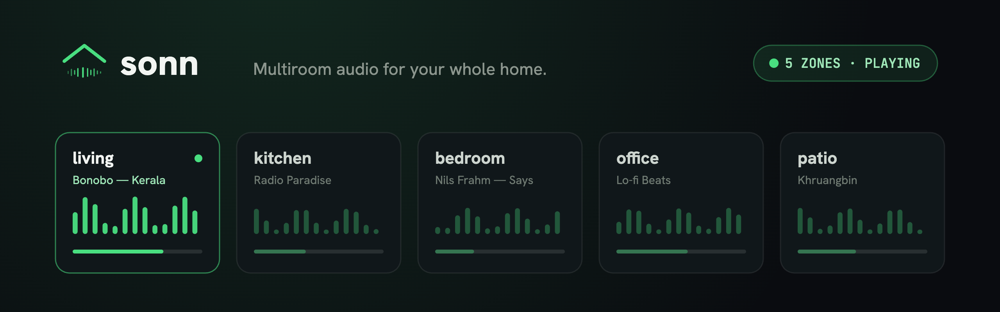

  

**Open-source, whole-home multiroom audio.**
A complete standalone server with the player built in — fully compatible with Loxone.

---

| Repo | What it is |
|------|------------|
| **[core](https://github.com/sonn-audio/core)** | A complete, **standalone multiroom audio server** — sources, zones, streaming, with the Player built in. Fully compatible with Loxone. |
| **[player](https://github.com/sonn-audio/player)** | The player UI. **Bundled with Core**; can also run standalone against a **Loxone Audioserver**. |
| **[docs](https://github.com/sonn-audio/docs)** | Documentation, install guides and the API reference. |
